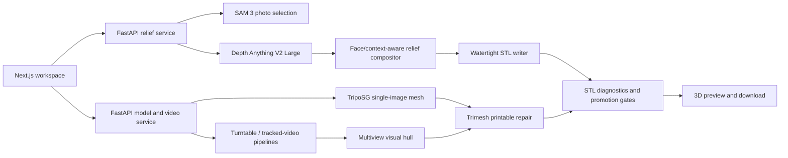

# 3D Print a Picture: Engineering and Research Report

Status: product close-out, July 2026

This document is the index for the repository's production architecture,
training work, datasets, benchmark decisions, and reproducibility evidence.
It separates the **one model used for each production feature** from the larger
set of research candidates retained for auditability.

At close-out the repository contains:

- 83 compact benchmark-evidence bundles and 354 evidence files;
- 55 repeatable experiment configurations;
- 95 backend test modules and 6 Playwright specifications;
- local 3080 Ti runs, Colab G4 Blackwell runs, checksum-pinned payloads, and
  machine-readable promotion decisions;
- photo relief, scene diorama, single-image mesh, turntable video mesh, tracked
  video relief, STL repair, printer sizing, and interactive preview paths.

The project is STL-first. A convincing render is not considered a success
unless the emitted mesh also satisfies the applicable printability gates.

## Product architecture



The primary runtime surfaces are:

| Surface | Responsibility |
| --- | --- |
| `frontend/app/page.tsx` | Media import, route selection, production model display, physical controls, run state, STL viewer, diagnostics, and download. |
| `backend/main.py` | Photo selection, depth inference, relief shaping, scene-diorama execution, STL emission, and physical diagnostics. |
| `backend/video_selection_service.py` | Model/profile API, single-image mesh runner, multiview runner, turntable video runner, tracked-relief runner, and artifact URLs. |
| `backend/pic_to_3d.py` | Depth-to-relief geometry, face/context preservation, mesh construction, and metadata. |
| `backend/benchmark/` | Dataset generation, providers, training, scoring, promotion gates, Colab packaging, evidence ingest, and replay. |
| `backend/model_profiles.py` | Machine-readable production choices, exact revisions, reasons, settings, limitations, and evidence pointers. |

## One production model per feature

The application no longer presents a model zoo. Each feature has one selected
production implementation. Research alternatives remain in benchmark code and
candidate metadata, where they cannot be mistaken for shipped defaults.

| Product feature | Production choice | Why it was selected |
| --- | --- | --- |
| Still-image object selection | `facebook/sam3` | The pinned concept path reached 1.0 face/torso mask IoU for all three people on the exact shirt-omission regression; the same checkpoint also selected buildings and a vehicle through cached open-vocabulary masks. |
| Photo and scene depth | `depth-anything/Depth-Anything-V2-Large-hf` | It is the verified CUDA path used by the face, background, height, exact-shell, and object-depth regressions. An August 2026 audit held DA3MONO, InfiniDepth, and both MetricAnything students because every challenger regressed 30 mm eyes/nose/mouth geometry or worse. Its pinned model-card weights are CC BY-NC 4.0, so this quality selection is not commercial-license clearance. |
| Single-image full mesh | `VAST-AI/TripoSG` | It is the only measured single-image provider promoted on the held-out ten-object STL-quality slice with zero failed checks. |
| Controlled turntable segmentation | Temporal-prior GrabCut | It is deterministic, offline, and directly covered by the controlled-video mask and STL regressions. |
| Tracked-video segmentation | `facebook/sam2.1-hiera-tiny` | It is the attached temporal propagation path that fits the local GPU budget; larger/gated checkpoints remain research candidates. |
| Tracked-relief frame choice | Sharpness/motion selector | It rejects blur while maintaining temporal and appearance coverage for the best printable relief frame. |
| Turntable frame choice | Uniform frame sampler | A fixed-camera full rotation needs deterministic angular coverage rather than a learned scene selector. |
| Turntable camera assignment | Frame-time orbit prior | It exactly matches the supported fixed-camera/rotating-object capture contract and does not overclaim general camera recovery. |
| Turntable reconstruction | Resolution-32 visual hull | It was the best measured deployable multiview lane and passed the hard STL gates on its ten-object slice. |
| STL cleanup | Trimesh printable repair | This is the shared path exercised by watertightness, manifoldness, winding, volume, component, drift, and complexity gates. |

The exact machine-readable entries, revision pins, reasons, and evidence links
are returned by `GET /profiles` from `backend/model_profiles.py`.

Image completion is not a production feature. The application preserves
original source pixels for relief depth, uses a neutral cutout only to guide
small or occluded face detection, and rejects legacy completion requests.
Inpainting models, LoRA training, and their measured outcomes remain below as
research history so model-selection decisions stay reproducible.

## Main production routes

### 2.5D photo relief

The relief route estimates one full-scene depth field, converts the required
polarity to near-high relief, preserves selected-subject detail, retains
bounded background depth, adds the backing shell, and emits one printable
component. Face handling is deliberately bounded: it cannot alter pixels
outside the face/subject support or silently violate attachment and height
constraints.

The production backing is a user-controlled flat plate (`2.4 mm` by default),
not the legacy `0.01 mm` numerical buffer. It translates the approved front
surface without changing its relief span or gradients and closes on an exact
`Z=0` print plane.

The 30 mm production path preserves:

- face height and six named facial-part measurements;
- full-scene background depth rather than a flat surround;
- maximum slope and background cap;
- subject/background attachment continuity;
- one watertight, manifold, positive-volume component;
- exact agreement between the approved height field and the emitted shell.

The complete algorithm history and current gates are in
[relief-face-context-v2.md](relief-face-context-v2.md). Compact exact replays
are under
[`benchmark-evidence/cc0_live_api_face_background_30mm_n3`](benchmark-evidence/cc0_live_api_face_background_30mm_n3)
and the surrounding face/background evidence bundles.

Print scale is now independent of relief calculation resolution. The route
processes filtering, background context, face protection, and geometry guards
on `detail_basis_mm`, then applies `max_xy_size` only to emitted X/Y
coordinates. A measured 30% private group-photo replay retained the exact
`384 x 512` Z field from the accepted 256 mm run (`0.0 mm` maximum delta,
`0.0` RMSE, correlation `1.0`) while exporting a 76 mm footprint. All three
face components passed detail retention and the STL remained one watertight,
manifold component with zero degenerates. Private pixels and derived geometry
remain local. Post-scale slope and feature telemetry is reported separately
because a tiny physical print cannot reproduce every retained sub-nozzle
sample. See
[relief-scale-independent-sampling.md](relief-scale-independent-sampling.md).

The default `Trim empty sky` pass no longer treats every strong image edge as
the skyline. The structural v2 detector fixed the original single-color mask,
but a difficult night photo showed that high-contrast clouds could still form
a broad blank slab around a narrow clock tower. The production v3 detector
requires sustained depth departure below an image boundary and treats the SAM
selection as a hard preservation constraint. Alpha remains authoritative for
transparent sources; missing or ambiguous depth fails closed to the structural
or complete-rectangle path. The mask is applied only at final mesh emission,
after depth shaping, smoothing, face guards, and background constraints.

On the exact private 2,048 x 1,536 replay, v3 removed `0.359029` of the upper
grid versus `0.276123` for v2. It removed zero selected or face pixels and all
`126,020/126,020` retained Z samples matched an untrimmed current-build control
bit-for-bit. The resulting 504,076-face STL remained one watertight, manifold,
winding-consistent positive volume with zero degenerate or non-manifold faces.
Private pixels and derived geometry remain local. Aggregate evidence is under
[`benchmark-evidence/relief_depth_supported_skyline_20260813`](benchmark-evidence/relief_depth_supported_skyline_20260813);
the earlier v2 record remains under
[`benchmark-evidence/relief_structural_skyline_20260812`](benchmark-evidence/relief_structural_skyline_20260812).

### Scene diorama

The scene route keeps a common monocular depth coordinate system for the
selected people, buildings, props, and background. It supports bounded scene
depth, subject volume, facade detail, depth separation, GLB output, and a
connected STL export. See
[single-photo-scene-diorama.md](single-photo-scene-diorama.md).

### Single-photo full mesh

The production profile pins:

- `VAST-AI/TripoSG@2c1c516d22d58db486a058d98d31bb6177344e06`;
- `briaai/RMBG-1.4@2ceba5a5efaec153162aedea169f76caf9b46cf8`;
- 50 inference steps and guidance 7.0;
- printable repair with adaptive voxel close;
- inferred deployable bbox calibration;
- scale-free face-density cap `9.95`;
- no unbounded convex-hull fallback.

The deciding G4 run completed 70/70 method/sample rows. The promoted
`triposg_biharmonic_prefill_repaired_stl_inferred_bbox_direct_mesh` candidate
scored `1.1038838` versus `0.1991798` for mirror, won 10/10 paired objectives,
and passed every per-sample printability gate. Candidate complexity never
exceeded `9.9499179`. Evidence:
[`benchmark-evidence/g4_stl_first_triposg_inferred_adaptive_s40_n10`](benchmark-evidence/g4_stl_first_triposg_inferred_adaptive_s40_n10).

### Video to STL

The controlled turntable route selects deterministic angular frames, generates
temporally stable foreground masks, assigns orbit cameras, carves a visual
hull, repairs it, and emits STL diagnostics. The tracked-relief route instead
uses sharpness/motion selection and temporal SAM propagation before sending
the best supported frame through the relief stack. See
[video-to-stl.md](video-to-stl.md).

## Data inventory

No private face photo, biometric template, or private source mesh is committed.
Private exact-photo replays are local gates only. Published evidence contains
compact metrics, hashes, and privacy-safe previews where licensing permits.

| Dataset / fixture | Scale | Purpose | Split and leakage policy |
| --- | ---: | --- | --- |
| ModelNet10 rendered meshes | Balanced rendered subsets; promoted decision uses held-out rows 40-49 | Half-image completion, depth, direct mesh, Chamfer/H95, held-out views, and STL quality | Asset keys, categories, source splits, and source-oracle fields are audited; source geometry is evaluation-only. |
| MakeHuman CC0 face training | 320 scenes, 32 meshes, 8 identity groups, 4 expressions | Small-face depth and six-part geometry supervision | 240 train / 40 validation / 40 sealed; identity-disjoint; both yaw signs, two resolutions, three backgrounds, three lights, and eye-band occlusions. |
| Google GNM-derived privacy-safe corpus | 255 rows, 40 identities, 2,295 assets | Camera-aligned face geometry and small/medium/close face training | 191 train / 32 validation / 32 sealed; row, identity, path, source-image, depth, and mask leakage checks. |
| C3I-SynFace diagnostic | 120-row licensed synthetic slice | Out-of-domain raw EXR face-depth residual training | Training/evaluation diagnostic only; no production promotion. |
| Procedural turntable set | Three procedural shapes in the local smoke; ten-object slices in architecture sweeps | Frame selection, masks, camera bundle, visual hull, and final STL metrics | Deterministic generated source; source mesh remains an oracle only. |
| CC0 varied-context photos | Checksum-pinned compact face/background fixtures | Dark skin, eyewear, cast shadow, yaw, framing, background, and exact API regressions | Public/license-compatible sources only; semantic near-duplicate guards across held-out sets. |

Important corpus provenance:

- MakeHuman compact fixture SHA256:
  `5da31444928a0d4d28522cd21dd4f5506946fdbb3c1436cabbbbea12ec054361`.
- GNM combined summary SHA256:
  `67abfa2b59e00f9cf7c0d3ae6a9b66960d7b97203b9d57b5b92ec791216d94bc`.
- GNM ordered artifact SHA256:
  `8940492360c1def86bb9da66910758f25148ed3b80e31297f4a1aa6f10080d09`.
- GNM production cache manifest SHA256:
  `f408f166d7cd11fe6c6b9a84b9ac9df9d4d0a78da905f2295dd912b88dd4fe61`.

## Training and fine-tuning record

All learned candidates had to pass a staged selector:

1. deterministic capacity smoke;
2. identity-disjoint validation;
3. sealed split only after validation success;
4. exact production-photo replay only after sealed success;
5. 30 mm physical and background replay only after exact-photo success;
6. production change only if every relevant gate improves or remains within its
   explicit non-regression bound.

This fail-closed order prevents tuning on private photos or repeatedly opening
the sealed set.

### Diffusion inpainting LoRA

The repository exports masked/full/object-mask pairs, derives optional
per-example weights from downstream object-surface/depth failures, and trains
DreamShaper-compatible LoRA adapters with mask, seam, object, and prompt
objectives. Training provenance includes pair hashes, recipes, prompt-family
checks, adapter hashes, split audits, and replay tools.

The best measured learned candidates improved on their public DreamShaper
baseline in some seam, continuity, and downstream depth metrics, but did not
beat mirror/biharmonic on the held-out paired objective. They remain benchmark
history, not product choices. Full tables and commands are in
[completion-benchmark.md](completion-benchmark.md).

### DAv2 head-only face training

The 331,969-parameter head froze the DINOv2 backbone and DAv2 neck and trained
with exact near-high depth, two-times named-part weighting, value/gradient/
Laplacian losses, and background distillation. A favorable synthetic 10% blend
reduced validation failures from 200 to 194, but exact production replay stayed
at 19 aggregate failures and regressed gradient correlation. It was held.
Evidence:
[`benchmark-evidence/face_depth_training_20260716`](benchmark-evidence/face_depth_training_20260716).

### GNM structured face geometry

The GNM work tested structured coefficients, DAv2 embeddings, MediaPipe
landmarks/blendshapes, rigid camera rotation, and a corpus expansion from 228
to 417 detector-clean training rows. The expanded model improved synthetic
validation RMSE to `0.007489` and sealed RMSE to `0.006695`, but the hard
exact-photo row retained eight named-part failures and slightly regressed raw
gradient correlation. It was held. Evidence:
[`benchmark-evidence/gnm_face_camera_and_corpus_expansion_20260717`](benchmark-evidence/gnm_face_camera_and_corpus_expansion_20260717).

### DINOv2 spatial decoders

The privacy-safe DINOv2 studies froze official DINOv2 Small features and
trained bounded camera-aligned residual decoders. The size-balanced corpus
contains 255 rows across small, medium, and close faces. Aggregate validation
geometry improved, but every nonzero blend caused a whole-face or named-part
regression; production remained unchanged. Evidence:
[`benchmark-evidence/dinov2_face_spatial_balanced_20260725`](benchmark-evidence/dinov2_face_spatial_balanced_20260725).

### Selective correction gate

A 108,897-parameter confidence head learned per-pixel acceptance from training
oracles. Its best validation candidate reduced aggregate part failures from
353 to 320, but all 32 validation rows regressed at least one strict metric.
Lowering coverage did not rank facial-part safety correctly, so the lane was
closed. Evidence:
[`benchmark-evidence/dinov2_face_correction_gate_20260725`](benchmark-evidence/dinov2_face_correction_gate_20260725).

### Coarse-to-fine face geometry

The original coarse-to-fine challenger predicts broad 40x40 camera-aligned
shape and bounded 160x160 detail. A two-row smoke passed its capacity gate.
The 191/32/32 identity-disjoint run improved aggregate shape correlation from
`0.820402` to `0.824738` and RMSE from `0.186267` to `0.185279` at full
strength, but still produced named-part regressions and was held before sealed
or private replay. Evidence:
[`benchmark-evidence/coarse_to_fine_face_geometry_20260725`](benchmark-evidence/coarse_to_fine_face_geometry_20260725).

## Provider and architecture comparisons

| Candidate | Outcome | Main reason |
| --- | --- | --- |
| TripoSG | **Production** | Promoted on paired held-out n=10; all printability gates passed. |
| Pixal3D | Hold | One-row repaired output was printable, but surface Chamfer/H95 regressed; insufficient paired evidence. |
| Hunyuan3D-2mv | Hold | Strong held-out views and 9/10 paired objective wins in the final density study, but hull fallback and hard fill-drift outliers failed promotion. |
| TRELLIS.2 | Hold | Raw open topology and thousands of self-intersections could not be repaired within complexity and drift gates without hull fallback. |
| Step1X-3D | Integrated challenger, not promoted | Official source/model pins and strict schema-v2 ingest were prepared; the required >=80 GB G4 evaluation was not run when Colab had no compute allocation. |
| TripoSR | Hold | Integration worked, but raw/repaired outputs retained manifold/degenerate/complexity failures. |
| Visual hull | **Production for controlled multiview** | Resolution 32 passed printability and complexity gates with the best deployable multiview score. |
| Hunyuan/TRELLIS post-hoc repair sweeps | Closed | Repeated repair tuning traded topology for excessive fill/surface drift. |

Raw provider output and repaired output are always scored separately. Source
geometry is diagnostic-only and never grants promotion eligibility.

## Metrics and gates

### Image and depth

- RGB MAE and perceptual similarity;
- seam continuity and masked-region quality;
- object-only depth MAE;
- affine-aligned physical RMSE and p95 error;
- six-part face shape and raw-gradient correlation;
- support coverage, bias, span retention, normal agreement, and relighting
  correlation;
- background depth correlation, centered RMS, robust span, and local-window
  retention.

### Mesh and STL

- mesh-surface Chamfer L1 and H95;
- held-out silhouette/view agreement;
- watertightness, manifoldness, winding consistency, and positive volume;
- non-manifold edges, degenerate faces, self-intersections where available,
  connected components, and bbox health;
- canonical repair fill drift with explicit volume provenance;
- repair-induced volume/bbox/surface drift;
- scale-free face-density complexity;
- runtime and peak CUDA memory;
- minimum printable feature, printer volume, physical dimensions, cap,
  attachment, and exact-shell agreement.

Metric schema v2 treats signed volume from open or inconsistently wound raw
meshes as unreliable and uses a bounded orientation-invariant surface-derived
proxy where required. Legacy metrics remain available for historical replay,
but unsafe fallback fails closed.

### Close-out validation

The final project close-out was validated on the production working tree:

- backend: `1,105/1,105` unit and regression tests passed;
- frontend lint: zero warnings;
- frontend TypeScript: zero errors;
- frontend Playwright: `10` passed, `1` intentionally skipped;
- responsive browser coverage: `390`, `1,024`, `1,280`, and `1,440` pixel
  viewports;
- high-relief face focus: `14/14` canonical and MakeHuman smoke contracts
  passed at `30-40 mm`, including named parts, background preservation,
  physical cap/attachment, watertight topology, and exact-shell agreement.

## Reproducibility

1. Every promoted provider has an exact source/model revision or checksum.
2. Colab payloads are checksum-pinned and record GPU name, memory guard,
   runtime versions, payload hash, commit, configuration, and archive hash.
3. Experiment configs live in `backend/benchmark/experiment_configs`.
4. Compact evidence includes summaries, per-sample tables, selector decisions,
   preflights, and archive provenance.
5. Training checkpoints and full tensors may remain ignored when large, but
   their hashes, recipes, split summaries, code hashes, and compact results are
   committed.
6. Historical decisions are replayed under new metric schemas rather than
   silently rewritten.

Useful entry points:

```powershell
# Backend regression suite
.\backend\.venv\Scripts\python.exe -m unittest discover -s backend/tests -v

# Frontend type and browser contracts
cd frontend
npm run typecheck
npm run test:ui

# Rendered completion benchmark
.\backend\.venv\Scripts\python.exe -m backend.benchmark.run_completion_benchmark --help

# STL-first provider benchmark
.\backend\.venv\Scripts\python.exe -m backend.benchmark.run_stl_first_smoke --help
```

## Known limitations

- Single-view full 3D remains an inference problem: an unseen back is generated
  from learned priors, not recovered from evidence in the source image.
- The promoted TripoSG benchmark used a deployable depth-relief bbox prepass;
  the live runner uses operational minimum-dimension and aspect safeguards.
- The current 30 mm face path is materially improved and regression-gated, but
  the learned face challengers did not strictly improve every named part.
- Controlled turntable video is supported; general handheld camera recovery
  is not presented as production-ready.
- Step1X setup/evaluation still requires an eligible >=80 GB GPU allocation.
- Provider licenses differ. Source availability does not automatically imply
  unrestricted commercial deployment.

## Decision policy

The production profile changes only when a candidate:

1. uses deployable inputs with no source-geometry leakage;
2. completes the required held-out sample count;
3. beats the incumbent under paired objectives and confidence gates;
4. passes every applicable per-sample printability and drift guard;
5. preserves face, background, object, privacy, exact-shell, and printer
   controls relevant to its route;
6. records exact source/model/data/code provenance.

That policy is why the repository contains many sophisticated held candidates
and a small production stack. The research remains visible; the product stays
decisive.

## Documentation map

- [Completion benchmark](completion-benchmark.md)
- [STL-first architecture](stl-first-architecture.md)
- [Optimized model profile](optimized-model-profile.md)
- [30 mm face and context pipeline](relief-face-context-v2.md)
- [Face-aware relief](face-aware-relief.md)
- [Scene diorama](single-photo-scene-diorama.md)
- [Video to STL](video-to-stl.md)
- [Benchmark evidence index](benchmark-evidence/)
