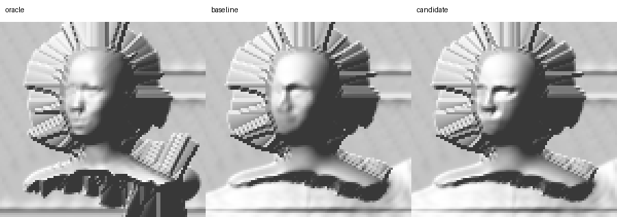

# MHR camera-depth face training, exact gate, and 30 mm replay

Status: **hold**. Production remains unchanged.

This lane replaces post-hoc face smoothing with supervised, camera-aligned face
depth learning. It uses Meta MHR v1.0.1 to generate exact camera-Z targets and
trains only the Depth Anything V2 depth head on a deterministic,
identity-disjoint synthetic corpus. No private photo, geometry, or coefficient
target is published.

## Reproducibility

- MHR source: official `facebookresearch/MHR` revision
  `4998cec385b1aaa07abdefba71bfba2f83c7db32`.
- MHR release archive SHA256:
  `e4f4f205cd87c0fa106577ba1de4fc763e4eb197c924461d2ef7e6944e9d6b94`.
- MHR model SHA256:
  `352e271a6c42729c68554ceaea0c955e866970160c31e35506d782dc0f7377bc`.
- MHR head mask SHA256:
  `60a64a305731dcc1c09f167dfa844246443b3115ae05abebe3813aa64a9ba2ae`.
- Clay corpus summary SHA256:
  `224be185284d810ff80c974d6d0c1dd82f768ed5de8fa0f39546572aeb3d8703`.
- Semantic-v2 corpus summary SHA256:
  `d8717cced1d8f6753c15a7367dc1c84c5e62e0439f87b4380cca65f55fd665a5`.
- Trained head SHA256:
  `1af484b0ff14bc27865bc6a3b33e79b90894d28677bcf62de4204822d892b59c`.

The semantic-v2 matrix contains 320 rows across 40 identities and eight
conditions per identity. Its exact split is 240/40/40 rows and 30/5/5
identities for train/validation/sealed evaluation. Face heights cover 64, 75,
96, and 128 pixels. The generator stores coefficient targets only in a private
training manifest that compact evidence must exclude.

## Results

The conservative small-face selector chose blend alpha `0.5`. On the sealed
40-row synthetic split, combined named-part failures fell from 431 to 384,
median shape correlation rose from 0.939119 to 0.948197, median raw-gradient
correlation rose from 0.868050 to 0.878609, and normalized RMSE fell from
0.115031 to 0.105408. On the 20 sealed faces at most 77 pixels tall, failures
fell from 225 to 206 and all three median metrics improved.

The exact three-row CC0 photo gate applies the residual only to the hardest
small-face row. That row improves from 10 to 9 combined failures: shape
correlation 0.804774 to 0.807012, raw-gradient correlation 0.625533 to
0.625799, and normalized RMSE 0.176007 to 0.175104. Eyewear and strong-turn
controls receive exactly zero residual and remain equivalent within the
`0.001` replay tolerance.

The first 30 mm replay exposed a shared emitter-budget defect: the current
emitter can add up to 0.4 mm of printable feature emboss after the base relief,
while the replay had already assigned all 30 mm to that base. The corrected
replay reserves a 29.6 mm base plus a 0.4 mm feature budget. Oracle, baseline,
and candidate then remain below the 30.011 mm hard ceiling, are one-component
watertight printable solids, and match their complete emitted shells exactly.
The candidate keeps its 9-to-8 emitted named-part gain. Paired background
correlation is 0.999983 with RMS retention 1.000211.

This physical replay is explicitly bound to the current workspace emitter,
SHA256 `587b9da5e98dd153413958da3f38d3feb7a8c60074a2dfb7640ea7cfa485c41c`.
That emitter contains unrelated uncommitted feature-emboss work and is not part
of this evidence commit. The replay is therefore current-workspace evidence,
not a claim that a clean checkout reproduces the same feature pass. The
challenger remains on hold for this reason as well as its remaining face-part
failures.

The shaded comparison is geometry-only and privacy-safe:

This gain is measurable but not yet acceptable for production: the emitted
candidate still has eight named-part failures. The model and checkpoint remain
challenger-only.

## Next provider

Research identified Meta's official
[`facebookresearch/sam-3d-body`](https://github.com/facebookresearch/sam-3d-body)
as the strongest next lead because it predicts MHR vertices, camera
translation, focal length, and expression parameters directly from an image.
The source is pinned at `b5c765a0d89d789985e186d396315e7590887b94`.
The gated model snapshot is `11aaa346c7204874a1cbafe3d39a979080b2c55a`.
Its DINOv3 dependency is loaded through `torch.hub`, so the smoke must also pin
the inspected DINOv3 revision
`6876159a11b4df116f30f667f8c9888617df0751` instead of following its moving
default branch.

The lane currently fails closed before setup: both the configuration and model
weights require explicit Hugging Face contact sharing under the SAM License,
the saved local Hugging Face token is invalid, and no checkpoint exists in the
local cache. No terms were accepted and no weights were downloaded. Once
authorized assets exist, the first smoke must use a caller-supplied person mask
and bbox, run body-only inference, retain the MHR head, add `pred_cam_t`, and
rasterize floating camera-Z with the predicted focal length. Canonical PLY or
normalized 8-bit depth is not an acceptable substitute.

See `results.json` for compact machine-readable metrics and hashes.
